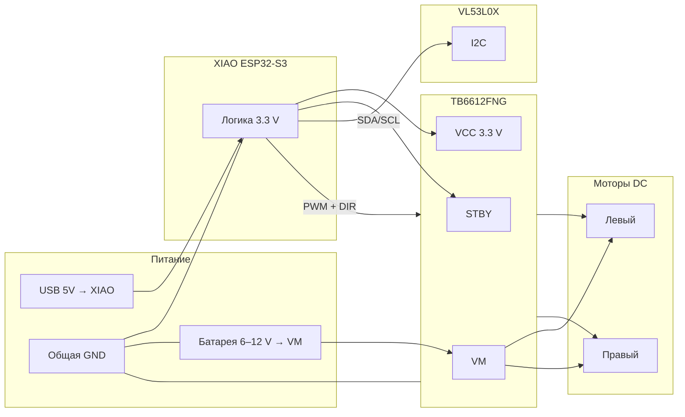
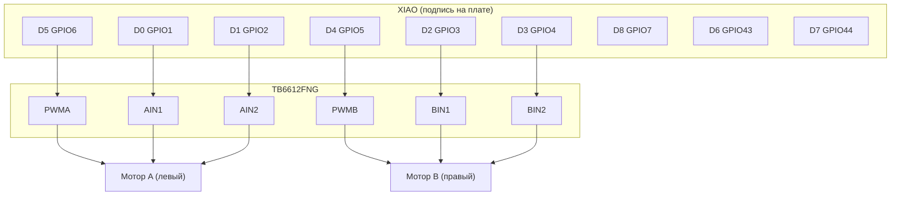
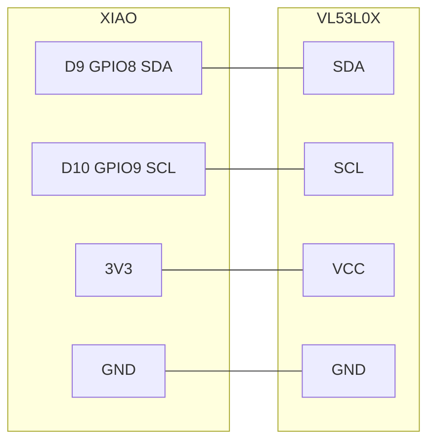

# Распайка: XIAO ESP32-S3 + TB6612 + VL53L0X

Пины из **`xiao_cam_stream/drive_config.h`** (прошивка build 14+).

> **Без камеры Sense** — скетч рассчитан на плату **без** модуля камеры. Если Sense стоит — не трогайте линии камеры (GPIO 10–18, 38–48), мик (41–42), LED (21).

---

## Общая схема (блоки)



---

## Питание и земля

```
                    ┌─────────────────┐
   USB 5V ──────────│ 5V   XIAO   GND │──────────┐
                    │ 3V3          │          │
                    └───────┬──────┘          │
                            │                 │
                     3.3 V ─┼─ VCC TB6612    │
                     3.3 V ─┼─ STBY (или    │
                            │   перемычка)  │
                            │                 │
   Батарея 6–12 V ── VM ───┤ TB6612          │
   (только моторы!)         │                 │
                            └──── GND общая ◄┘
                                   │
                            VL53L0X GND
```

| Точка | Куда | Примечание |
|-------|------|------------|
| **GND** | XIAO GND = GND TB6612 = GND VL53L0X = «−» батареи VM | **Обязательно общая земля** |
| **3V3** XIAO | TB6612 **VCC** (логика), VL53L0X **VCC** | Логика 3.3 V, не 5 V на датчик |
| **5V** XIAO | Не кормить TB6612 VM | 5V — только USB/плата |
| **VM** TB6612 | Батарея 6–12 V (или отдельный БП моторов) | Силовое питание моторов |
| **USB + батарея одновременно** | Избегать | Риск просадки/контуров; одна XIAO уже сгорала при плохой разводке GND |

`DRIVE_STBY_PIN = -1` → **STBY закоротить на 3.3 V** (драйвер всегда включён).

---

## TB6612 ↔ XIAO (моторы)



| TB6612 | XIAO (шелк) | GPIO | Роль |
|--------|---------------|------|------|
| **PWMA** | **D5** | 6 | ШИМ левый |
| **AIN1** | **D0** | 1 | Левый, направление |
| **AIN2** | **D1** | 2 | Левый, направление |
| **PWMB** | **D4** | 5 | ШИМ правый |
| **BIN1** | **D2** | 3 | Правый, направление |
| **BIN2** | **D3** | 4 | Правый, направление |
| **STBY** | **3.3 V** | — | HIGH = драйвер активен |
| **VCC** | **3.3 V** | — | Логика |
| **GND** | **GND** | — | |
| **VM** | **6–12 V** | — | Питание моторов |
| **AO1, AO2** | Левый мотор | | |
| **BO1, BO2** | Правый мотор | | |

Полярность моторов: если едет «назад» — поменять местами провода **AO1↔AO2** или **BO1↔BO2**.

---

## VL53L0X ↔ XIAO (радар / дальность)



| VL53L0X | XIAO | GPIO |
|---------|------|------|
| **VCC** | **3V3** | — |
| **GND** | **GND** | — |
| **SDA** | **D9** | **8** |
| **SCL** | **D10** | **9** |
| XSHUT | 3.3 V (опц.) | Подтяжка «всегда включён» |

### Запрещено

| Пины | Почему |
|------|--------|
| **GPIO19, GPIO20** (D7/D8 на некоторых шелкографиях — **проверьте свою плату**) | Линии **USB D− / D+** → после `Wire.begin` **пропадает COM** |
| **GPIO39, GPIO40** | Шина **камеры** (SCCB) на Sense |
| **GPIO8 для энкодера R_B** | Занят под **SDA ToF** (`DRIVE_ENC_R_B = 0`) |

На модуле XIAO **D9 = GPIO8**, **D10 = GPIO9** — подключайте ToF именно туда, **не** к «крайним» USB-пинам 19/20.

---

## Энкодеры (опционально)

| Сигнал | XIAO | GPIO | Статус |
|--------|------|------|--------|
| Левый A | **D6** | 43 | Включён |
| Левый B | **D7** | 44 | Включён |
| Правый A | **D8** | 7 | Включён |
| Правый B | — | 8 | **Отключён** (конфликт с SDA ToF) |

Энкодер: **3.3 V**, GND, каналы A/B → соответствующие GPIO (внутренняя подтяжка или внешние 10 kΩ к 3.3 V — по вашему модулю).

---

## Вид сверху (логические связи)

```
                    [ VL53L0X ]
                    VCC GND SDA SCL
                      │  │   │   │
                      └──┼───┼───┼──────────────┐
                         │   │   │              │
    [ Батарея 6-12V ]────┼───┼───┼── VM          │
           │             │   │   │              │
           └─ GND ────────┴───┴───┴── GND ───────┤
                                                 │
              ┌──────────────────────────────────┴──┐
              │         XIAO ESP32-S3               │
              │  D0-D5 ──────────────► TB6612      │
              │  D9,D10 ─────────────► ToF I2C     │
              │  D6,D7,D8 ───────────► энкодеры    │
              │  USB (прошивка / Serial)           │
              └────────────────────────────────────┘
                         │
              ┌──────────┴──────────┐
              │      TB6612FNG       │
              │  AO1 AO2    BO1 BO2  │
              └───┬───┬──────┬───┬───┘
                  │   │      │   │
               [Левый] [Правый мотор]
```

---

## Чеклист перед включением

1. **GND общая** у XIAO, TB6612, VL53L0X и источника VM.
2. ToF на **D9/D10 (GPIO8/9)**, не на 19/20.
3. **VM** не подключать к 5V XIAO.
4. STBY TB6612 = **HIGH** (3.3 V).
5. Первый запуск моторов — **низкая скорость** в `/drive` или джойстике.
6. Прошивка: `XIAO_TOF_ENABLE 1`, `XIAO_DRIVE_ENABLE 1` в `drive_config.h`.

---

## Связанные файлы

- `xiao_cam_stream/drive_config.h` — все `#define` пинов
- `xiao_cam_stream/xiao_tof.h` — `#error` при GPIO19/20
- `docs/incident-wifi-pc-router-2026-06-05.md` — инцидент USB/GPIO20
